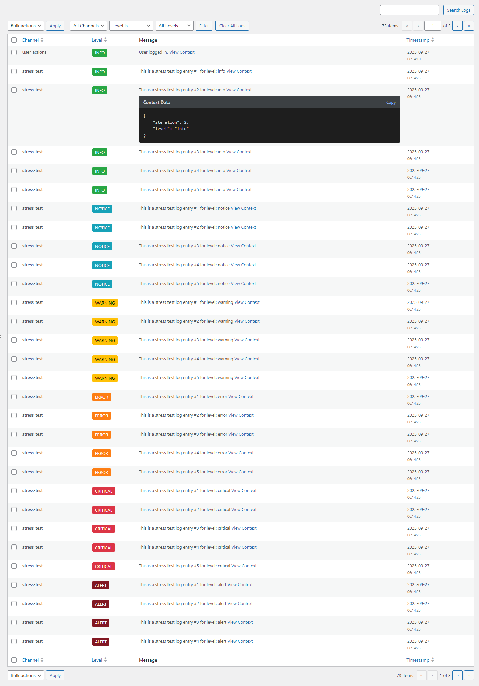

# WP Simple Logger

[](https://packagist.org/packages/wptechnix/wp-simple-logger)
[](https://packagist.org/packages/wptechnix/wp-simple-logger)
[](https://packagist.org/packages/wptechnix/wp-simple-logger)
[](https://packagist.org/packages/wptechnix/wp-simple-logger)

A powerful, flexible, and developer-friendly PSR-3 compliant logging library for WordPress. It provides a robust framework for capturing, managing, and storing application events, errors, and debugging information in a structured and efficient way.

Designed to be both simple for basic use and highly extensible for complex applications, this library is the ideal choice for plugin and theme developers who need a reliable logging solution that goes beyond `error_log()`.

## Key Features

-   ✅ **PSR-3 Compliant**: A standard, interoperable interface (`$logger->info(...)`, `$logger->error(...)`).
-   🗂️ **Channel-Based Logging**: Organize logs into different "channels" (e.g., 'payments', 'api', 'debug') for easy filtering.
-   🚀 **Multiple Handlers**: Ship logs to various destinations simultaneously.
    -   **File Handler**: Writes logs to a server file.
    -   **Database Handler**: Stores logs in a custom database table.
    -   **Email Handler**: Sends high-priority logs via email.
    -   **Slack Handler**: Posts color-coded alerts to a Slack channel.
    -   **Webhook Handler**: Ships structured JSON logs to any HTTP endpoint.
    -   **Null Handler**: Discards logs, handy for tests or disabling output.
-   🎨 **Customizable Formatters**: Control the output format with Line, JSON, or HTML formatters.
-   🖥️ **Built-in Log Viewer**: A beautiful, filterable, and searchable admin interface for logs stored in the database.
-   ⚡️ **Performance-Oriented**: Logs are buffered and written in batches during the `shutdown` hook to minimize impact.
-   🧩 **Extensible Architecture**: Easily create your own custom handlers and formatters.

### Powerful Admin Interface

The Database Handler includes a full-featured Log Viewer right in your WordPress dashboard.



## Installation

**Requirements:**
- PHP 8.0+
- WordPress 5.0+
- Composer

Install the library using Composer:
```bash
composer require wptechnix/wp-simple-logger
```
Then, ensure you include Composer's autoloader in your plugin or theme:
```php
require_once __DIR__ . '/vendor/autoload.php';
```

## Development

The toolchain runs entirely in Docker, so no local PHP or Composer is required.

### Using Docker Compose

```bash
# Open a shell in the PHP container
docker compose run --rm php bash

# Run tests inside the container
docker compose run --rm php composer test

# Run linters
docker compose run --rm php composer lint
```

### Running Tests

```bash
composer test             # Run PHPUnit tests
composer lint             # Run all linters (PHPCS, PHPStan)
composer phpcbf           # Auto-fix coding standards
```

## Quick Start

The easiest way to get started is to log messages to a file. Place this code in your main plugin file or your theme's `functions.php`.

```php
<?php

use WPTechnix\WP_Simple_Logger\Log_Manager;
use WPTechnix\WP_Simple_Logger\Handlers\File_Handler;

// A central function to initialize and retrieve the logger manager.
function my_project_logger_manager(): Log_Manager {
    static $manager = null;

    if ( null === $manager ) {
        // 1. Create the Log_Manager instance.
        $manager = new Log_Manager();

        // 2. Create a Handler to send logs to a file.
        $log_file_path = WP_CONTENT_DIR . '/uploads/logs/my-project.log';
        $file_handler = new File_Handler( $log_file_path );

        // 3. Add the handler to the manager.
        $manager->add_handler( $file_handler );

        // 4. Initialize the manager. This is crucial for registering WordPress hooks.
        $manager->init();
    }
    
    return $manager;
}

// Hook the initialization into WordPress.
add_action( 'plugins_loaded', 'my_project_logger_manager' );

/**
 * Example of how to use the logger.
 */
function some_function_that_does_stuff() {
    // 5. Get a logger instance for a specific "channel".
    $logger = my_project_logger_manager()->get_logger('user-actions');
    
    // 6. Log a message with context.
    $user_id = get_current_user_id();
    $logger->info(
        'User with ID {user_id} updated their profile.',
        ['user_id' => $user_id]
    );
}

add_action( 'profile_update', 'some_function_that_does_stuff' );
```

After a user profile is updated, the file `wp-content/uploads/logs/my-project.log` will contain:
```log
[2023-10-27 15:30:00] user-actions.INFO: User with ID 1 updated their profile. {"user_id":1}
```

## Full Documentation

For detailed information on all features, please refer to the documentation:

-   **[Getting Started](./docs/01-Getting-Started.md)** - A detailed walkthrough of the initial setup.
-   **[Handlers Guide](./docs/02-Handlers.md)** - Learn about sending logs to files, the database, and email.
-   **[Formatters Guide](./docs/03-Formatters.md)** - Customize your log output format (Line, JSON, HTML).
-   **[Log Viewer Guide](./docs/04-Log-Viewer.md)** - How to use the built-in admin log viewer.
-   **[Advanced Topics](./docs/05-Advanced-Topics.md)** - Multi-handler setups, creating custom handlers, and best practices.

## Flexible & Powerful

Combine handlers to create sophisticated logging workflows. For example, you can send all logs to a file, important logs to the database, and critical errors to both an email address and Slack, all at the same time.

```php
// --- In your manager setup ---
use WPTechnix\WP_Simple_Logger\Handlers\File_Handler;
use WPTechnix\WP_Simple_Logger\Handlers\Database_Handler;
use WPTechnix\WP_Simple_Logger\Handlers\Email_Handler;
use WPTechnix\WP_Simple_Logger\Handlers\Slack_Handler;
use Psr\Log\LogLevel;

// Handler 1: Log everything to a file.
$manager->add_handler(new File_Handler(
    WP_CONTENT_DIR . '/logs/full_app.log'
));

// Handler 2: Log 'payments' and 'api' channels to the database for auditing.
global $wpdb;
$db_handler = new Database_Handler($wpdb->prefix . 'app_logs');
$db_handler->set_channels(['payments', 'api']);
$manager->add_handler($db_handler);

// Handler 3: Email only critical errors from the 'payments' channel.
$email_handler = new Email_Handler(
    'alerts@example.com', 
    'Critical Payment Error', 
    LogLevel::CRITICAL
);
$email_handler->set_channels(['payments']); // Only 'payments'
$manager->add_handler($email_handler);

// Handler 4: Post critical payment errors to Slack as color-coded alerts.
$slack_handler = new Slack_Handler(
    'https://hooks.slack.com/services/XXX/YYY/ZZZ',
    LogLevel::CRITICAL
);
$slack_handler->set_channels(['payments']);
$manager->add_handler($slack_handler);
```


## License

This project is licensed under the MIT License - see the [LICENSE](LICENSE) file for details.
