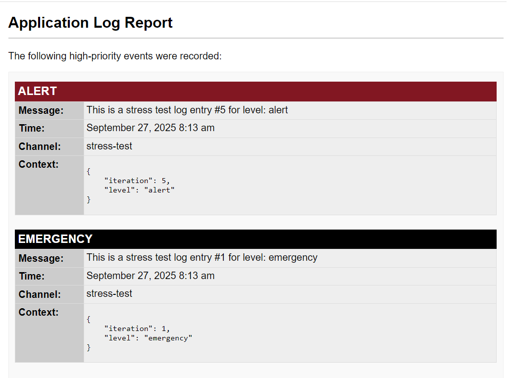

# Handlers Guide

Handlers are the workhorses of the logging library. Each handler is responsible for taking log records and writing them to a specific destination, such as a file, a database table, or an email.

You can add multiple handlers to the `Log_Manager` to send the same log record to several destinations at once. All handlers inherit from `Abstract_Handler` and share a set of common configuration methods.

## Common Configuration

These methods are available on all built-in handlers.

| Method                                      | Description                                                                                                               |
| ------------------------------------------- |---------------------------------------------------------------------------------------------------------------------------|
| `set_channels(array $names)`                | Restricts the handler to only process logs from the specified channel names. By default, it accepts all channels.         |
| `set_formatter(Formatter_Interface $formatter)` | Overrides the default formatter for the handler. See the **[Formatters Guide](03-Formatters.md)**.                           |
| `set_buffer_limit(int $limit)`              | Sets the number of log records to buffer before forcing a write. `0` disables this, relying only on the `shutdown` flush. |

---

## File Handler

Writes log records to a specified file on the server. This is the simplest handler and is great for general-purpose debugging.

### Constructor

`new File_Handler(string $path, string $min_level = 'debug', int $buffer_limit = 0, ?Formatter_Interface $formatter = null)`

-   **`$path`** (`string`, required): The absolute path to the log file (e.g., `WP_CONTENT_DIR . '/logs/app.log'`). The handler will attempt to create the directory if it doesn't exist.
-   **`$min_level`** (`string`): The minimum log level this handler will process (e.g., `'info'`, `'error'`). Defaults to `'debug'`. It is recommended to use the `Psr\Log\LogLevel` constants (e.g., `LogLevel::WARNING`) to prevent typos.
-   **`$buffer_limit`** (`int`): The number of records to buffer. Defaults to `0`.
-   **`$formatter`** (`?Formatter_Interface`): A custom formatter instance. Defaults to a `Line_Formatter`.

### Usage Example

```php
use WPTechnix\WP_Simple_Logger\Handlers\File_Handler;
use Psr\Log\LogLevel;

// Create a handler that only logs WARNING level and above to a specific file.
$file_handler = new File_Handler(
    path: WP_CONTENT_DIR . '/logs/warnings.log',
    min_level: LogLevel::WARNING // Prefer constants over strings like 'warning'
);

// Add it to the manager
$manager->add_handler($file_handler);
```

---

## Database Handler

Stores log records in a dedicated, optimized custom table in the WordPress database. This handler is powerful because it includes a full-featured admin log viewer.

### Constructor

`new Database_Handler(string $table_name, string $min_level = 'debug', int $buffer_limit = 20, int $expiry_seconds = 0)`

-   **`$table_name`** (`string`, required): The **full, unique name** for the log table (e.g., `{$wpdb->prefix}my_plugin_logs`). The handler automatically creates and maintains this table.
-   **`$min_level`** (`string`): The minimum log level to store. Defaults to `'debug'`.
-   **`$buffer_limit`** (`int`): Defaults to `20`. A higher buffer limit can improve performance for high-volume logging.
-   **`$expiry_seconds`** (`int`): The number of seconds to keep logs before they are automatically deleted. `0` means logs are kept forever. Cleanup runs hourly via a transient lock. Defaults to `0`.

### Configuration Methods

#### `set_admin_viewer()`

This method enables the built-in log viewer in the WordPress admin area.

`set_admin_viewer(string $parent_menu_slug, string $page_slug, string $page_title = 'Application Logs', string $menu_title = 'Logs', string $capability = 'manage_options'): self`

-   **`$parent_menu_slug`**: The slug of the parent menu item (e.g., `'tools.php'`, `'options-general.php'`, or a custom top-level menu slug).
-   **`$page_slug`**: A unique slug for the log viewer page (e.g., `'my-plugin-logs'`).
-   **`$page_title`**: The title displayed on the log viewer page.
-   **`$menu_title`**: The text for the link in the admin menu.
-   **`$capability`**: The user capability required to access the page.

### Usage Example

```php
global $wpdb;
use WPTechnix\WP_Simple_Logger\Handlers\Database_Handler;
use Psr\Log\LogLevel;

// One month in seconds (30 * 24 * 60 * 60)
define( 'ONE_MONTH_IN_SECONDS', 2592000 );

// Create a handler that stores logs in the DB for 30 days
$db_handler = new Database_Handler(
    table_name: $wpdb->prefix . 'my_app_logs',
    min_level: LogLevel::INFO,
    expiry_seconds: ONE_MONTH_IN_SECONDS
);

// Enable and configure the admin UI under the "Tools" menu
$db_handler->set_admin_viewer(
    parent_menu_slug: 'tools.php',
    page_slug: 'my-app-log-viewer',
    page_title: 'My App Logs',
    menu_title: 'App Logs',
    capability: 'manage_options'
);

$manager->add_handler($db_handler);
```
For more details on the UI, see the **[Log Viewer Guide](04-Log-Viewer.md)**.

---

## Email Handler

Buffers log records and sends them in a single, formatted HTML email when the buffer is full or the request ends. This is ideal for critical error notifications.

### Constructor

`new Email_Handler(string|array $to_recipients, string $subject, string $min_level = 'error', int $buffer_limit = 10, ?Formatter_Interface $formatter = null)`

-   **`$to_recipients`** (`string|array`, required): The email address or an array of addresses to send the notification to.
-   **`$subject`** (`string`, required): The subject line for the email.
-   **`$min_level`** (`string`): The minimum log level to email. **It is highly recommended to use `'error'` or higher** to avoid spam. Defaults to `'error'`.
-   **`$buffer_limit`** (`int`): The maximum number of log records to include in one email. Defaults to `10`.
-   **`$formatter`** (`?Formatter_Interface`): A custom formatter. Defaults to an `Html_Formatter`.

### Configuration Methods

These methods allow you to customize the content of the email.

| Method                         | Description                                |
| ------------------------------ | ------------------------------------------ |
| `set_email_title(string $title)`   | Sets the main `<h2>` title inside the email body. |
| `set_email_intro(string $intro)`   | Sets the introductory paragraph.           |
| `set_email_footer(string $footer)` | Sets the footer text.                      |
| `set_headers(array $headers)`      | Sets custom email headers (e.g., `From:`, `Reply-To:`). |

### Example Email Output


### Usage Example

```php
use WPTechnix\WP_Simple_Logger\Handlers\Email_Handler;
use Psr\Log\LogLevel;

// Send an email for any CRITICAL errors.
$email_handler = new Email_Handler(
    to_recipients: 'dev-alerts@example.com',
    subject: 'Critical Error on Production Site',
    min_level: LogLevel::CRITICAL,
);

// Customize the email content
$email_handler
    ->set_email_title('Critical Site Alert')
    ->set_headers(['From: WordPress <wordpress@example.com>']);

// Add it to the manager
$manager->add_handler($email_handler);
```

---

## Slack Handler

Posts log records to a [Slack Incoming Webhook](https://api.slack.com/messaging/webhooks). Each record is rendered as a color-coded attachment whose color reflects the severity, so high-priority alerts are easy to spot in a channel. Because Slack is an alerting destination, it defaults to the `error` level.

### Constructor

`new Slack_Handler(string $webhook_url, string $min_level = 'error', int $buffer_limit = 10)`

-   **`$webhook_url`** (`string`, required): The Slack Incoming Webhook URL.
-   **`$min_level`** (`string`): The minimum log level to post. Defaults to `'error'` to avoid noise.
-   **`$buffer_limit`** (`int`): The number of records to batch into a single message. Defaults to `10`.

### Configuration Methods

| Method | Description |
| ------ | ----------- |
| `set_username(string $username)` | The bot name shown in Slack. Defaults to `WP Simple Logger`. |
| `set_icon_emoji(string $emoji)` | An emoji shortcode used as the message icon, e.g. `:rotating_light:`. |
| `set_channel(string $channel)` | Override the destination channel, e.g. `#alerts`. |
| `set_timeout(int $seconds)` | HTTP request timeout in seconds. Defaults to `5`. |
| `set_blocking(bool $blocking)` | Whether to wait for the HTTP response. Defaults to `false` (fire and forget). |

### Usage Example

```php
use WPTechnix\WP_Simple_Logger\Handlers\Slack_Handler;
use Psr\Log\LogLevel;

$slack_handler = new Slack_Handler(
    webhook_url: 'https://hooks.slack.com/services/XXX/YYY/ZZZ',
    min_level: LogLevel::ERROR
);

$slack_handler
    ->set_channel('#alerts')
    ->set_icon_emoji(':rotating_light:');

$manager->add_handler($slack_handler);
```

---

## Webhook Handler

Posts buffered log records to any HTTP endpoint as a single JSON document shaped as `{ "logs": [ ... ] }`. This is a convenient building block for shipping logs to custom ingestion services or third-party platforms.

### Constructor

`new Webhook_Handler(string $webhook_url, string $min_level = 'debug', int $buffer_limit = 10)`

-   **`$webhook_url`** (`string`, required): The endpoint that receives the request.
-   **`$min_level`** (`string`): The minimum log level to send. Defaults to `'debug'`.
-   **`$buffer_limit`** (`int`): The number of records per request. Defaults to `10`.

### Configuration Methods

These methods are shared by all webhook-based handlers (`Webhook_Handler`, `Slack_Handler`, and any handler extending `Abstract_Webhook_Handler`).

| Method | Description |
| ------ | ----------- |
| `set_method(string $method)` | The HTTP method. Defaults to `POST`. |
| `set_headers(array $headers)` | Replace all request headers (keyed by name). |
| `add_header(string $name, string $value)` | Add or override a single header, keeping the default `Content-Type: application/json`. |
| `set_timeout(int $seconds)` | HTTP request timeout in seconds. Defaults to `5`. |
| `set_blocking(bool $blocking)` | Whether to wait for the HTTP response. Defaults to `false`. |
| `set_request_args(array $args)` | Extra `wp_remote_request()` arguments for settings not covered above, e.g. `sslverify`. Managed keys (method, headers, body, timeout, blocking) always take precedence. |

Each log record is serialized with the fields `channel`, `level`, `level_name`, `message`, `context`, `datetime`, and `timestamp`.

### Usage Example

```php
use WPTechnix\WP_Simple_Logger\Handlers\Webhook_Handler;

$webhook_handler = new Webhook_Handler('https://logs.example.com/ingest');
$webhook_handler
    ->set_method('POST')
    ->add_header('Authorization', 'Bearer YOUR_TOKEN');

$manager->add_handler($webhook_handler);
```

To customize the payload shape (for example, to target Discord or Microsoft Teams), extend `Abstract_Webhook_Handler` and implement `build_payload()`. See the **[Advanced Topics](05-Advanced-Topics.md)** guide.

---

## Null Handler

Accepts and silently discards every log record. This is useful for disabling logging in a specific environment without changing your wiring, and as a stand-in during tests.

### Usage Example

```php
use WPTechnix\WP_Simple_Logger\Handlers\Null_Handler;

// Discards everything; add real handlers only where you want output.
$manager->add_handler(new Null_Handler());
```
